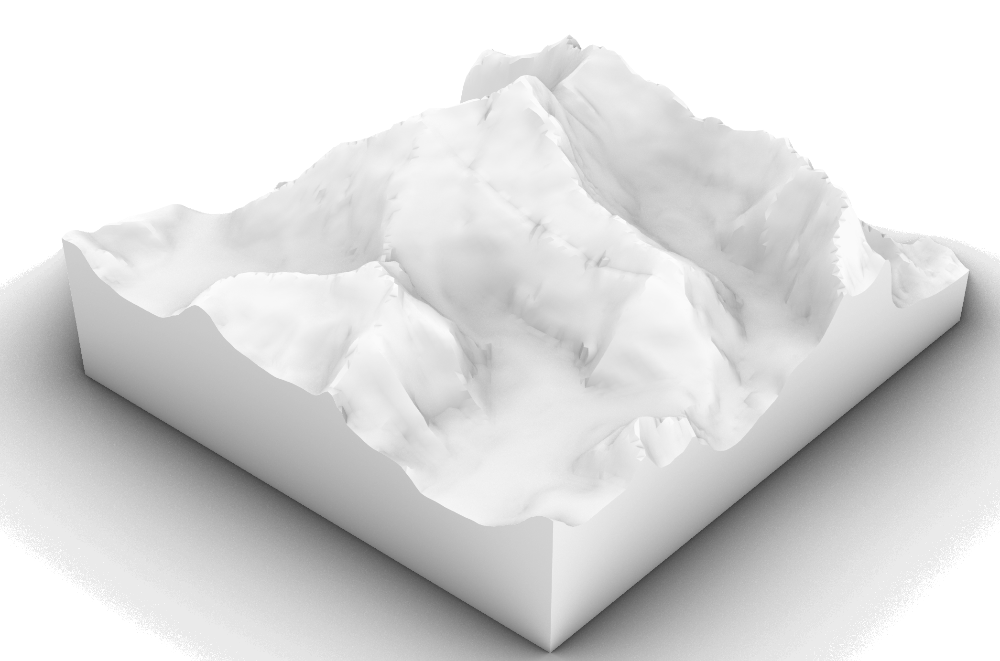

# Short Summary
A module that takes an .stl file of a topology that is not prepared for a Pedestrian Wind Comfort Analysis on the SimScale platform, and return an stl file that is.

### Installation
```bash
pip install git+https://github.com/DHLynch/topo_extend.git
```

### Quick Start
Import this package and pathlib
```bash
from topo_extend.Topo_extend_v2 import topology
import pathlib
```

Set the stl to import using a path, and define the output stl using a path
```bash
input_path = pathlib.Path('test_case_1.stl')
output_path = pathlib.Path('TOPOLOGY_EXTENSION.stl')
```

Initialise the topology object
```bash
mesh_clean = topology(origin=[0,0,0],
                      resolution=1)
```

Perform the extension
```bash
mesh_clean.extend_stl(input_path,
                      output_path,
                      extension_radius=500,
                      inclusion_radius=50)
```

Output
Original Mesh             |  Mesh after extension
:-------------------------:|:-------------------------:
  |  

# Introduction
SimScale's LBM/PWC solution is incredibly robust to CAD/Geometry/3D model quality issues, however some preperation is still required to ensure results are reliable.

One of these steps involves ensuring that a topology or terrain (if pressent) surface is hole free (within reason) and extends past the boundary of a wind tunnel. More information as to why this is required can be found directly on the SimScale documentation pages.

Typically the user would need to open their model in a 3D moddeling tool such as Rhino to do these modifications, however, usually due to time constraints or knowledge gaps this process produces its own problems in terms of artifacts or still has issues.

# A perfect solution
There is no perfect solution, but lets talk briefly about the properties of the topology that would make it perfect.

1. The topology is a single surface that is big enough to intersect all edge faces of the wind tunnel.
2. The topology has enough resolution and no artifacts that would artificially influence the flow.
3. The topology would be completelly flat at the inlet so as not to influence the sape of the ABL.

Now, from the above we can see that to meet those points we would need to satisfy contradictary requirments and possible pay alot to obtain the size of topology required.

# This solution
To be able to obtain a reasonable topology surface from a typical users topology we need to do the following:

1. Take a complex collection of meshes (as an STL) and return the top surface mesh.
2. Isolate a circle that is smaller than some inclusion radius from a centre (origin) location.
3. Extend the parimeter out from a centre point.
4. Smooth the extension so that it does not have any artificial influence on results and that the ABL is not over fitting the topology or influenced dramatically at the boundaries.
5. Export a new STL file.

An experienced user will know that more original topology is better, but will be able to weigh up how much is needed.

# Future development
1. Currently the mesh, although clean, cn be large, this can be controlled by setting a resolution but really we would like to remove cells in parts of the surface that are not dramatically changing making the file size more efficient.
2. Cut the mesh and export as a region of interest mesh, inclusion mesh and extension mesh.
3. Fill gaps in the mesh that lie in the inclusion circle
4. Create some reporting where the height map, and explaination of the topology elements are given. For example, what holes were filled automatically or where was the region of inclusion and region of interest defined.
5. A CLI function to do some default processing
6. integrate the CLI into a grasshopper component.

